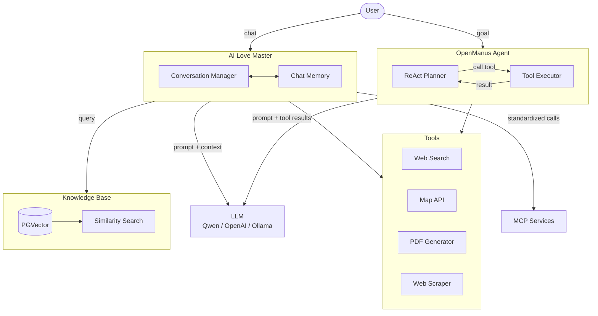
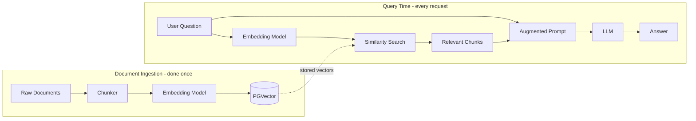

# AI Agent Development

A learning project I completed working through a comprehensive AI development course. Built two AI applications from scratch using Java/Spring AI — a conversational chatbot with a custom knowledge base, and an autonomous agent that plans and executes tasks.

---

## What I Built

**AI Love Master** — a multi-turn conversational AI that retrieves answers from a custom knowledge base, calls external tools (map services, web search), and integrates with MCP services. Users can ask questions and the system searches relevant documents before responding rather than relying purely on the model's training data.

**OpenManus Agent** — an autonomous agent based on the ReAct pattern. Give it a goal, it figures out the steps, calls the necessary tools, handles failures, and generates a final report. Built on top of the tool-calling infrastructure from the previous module.



---

## Tech Stack

- Java 21 + Spring Boot 3
- Spring AI
- PostgreSQL + PGvector (vector database)
- Ollama (local model deployment)
- Jsoup (web scraping), iText (PDF generation)
- External APIs: SearchAPI, Pexels, Amap

---

## Getting Started

**Requirements:** Java 21+, PostgreSQL 14+ with pgvector, Maven

```bash
git clone https://github.com/yourusername/ai-agent-development.git
cd ai-agent-development
cp .env.example .env
# Add your API keys to .env
psql -U postgres -d ai_agent < schema.sql
mvn spring-boot:run
```

API docs at http://localhost:8080/doc.html

---

## What I Learned

- How RAG actually works in practice — chunking documents, embedding them, and searching by vector similarity before passing context to the LLM
- Spring AI's abstractions for LLM integration, conversation memory, and structured output
- Tool calling patterns — defining tools the model can request, executing them in the application layer, returning results
- MCP protocol for standardized service integration
- How the ReAct pattern works for autonomous agent reasoning

### RAG pipeline



### ReAct agent loop


---
