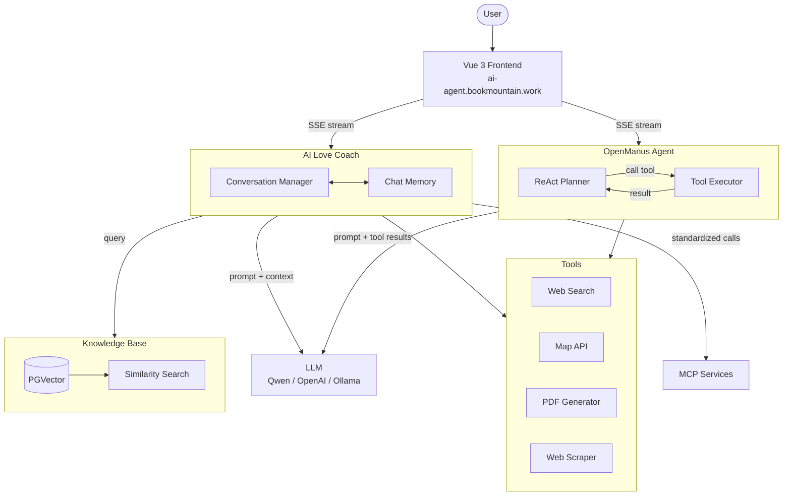
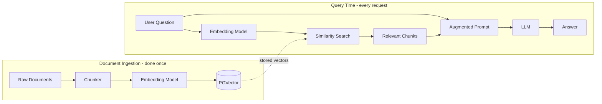
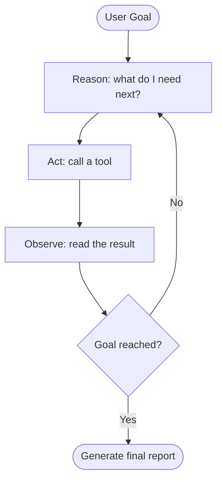

# AI Agent Development

A learning project I completed working through a comprehensive AI development course. Built two AI applications from scratch using Java/Spring AI — a conversational chatbot with a custom knowledge base, and an autonomous agent that plans and executes tasks. Both are accessible through a Vue 3 web interface.

**Live demo:** https://ai-agent.bookmountain.work

---

## What I Built

**AI Love Coach** — a multi-turn conversational AI that retrieves answers from a custom knowledge base, calls external tools (map services, web search), and integrates with MCP services. Users can ask questions and the system searches relevant documents before responding rather than relying purely on the model's training data. Responses stream in real time via SSE.

**Super Agent (OpenManus)** — an autonomous agent based on the ReAct pattern. Give it a goal, it figures out the steps, calls the necessary tools, handles failures, and generates a final report. The UI separates the agent's internal reasoning steps from its final answers, so you can follow its thought process as it works.

**Web UI** — a Vue 3 single-page app with two chat interfaces. Both use Server-Sent Events for streaming so responses appear token by token rather than waiting for the full reply.



---

## Tech Stack

**Backend**
- Java 21 + Spring Boot 3
- Spring AI (LLM integration, RAG, tool calling, MCP client)
- PostgreSQL + pgvector (vector database)
- Ollama (local model deployment)
- Jsoup (web scraping), iText (PDF generation)
- External APIs: SearchAPI, Pexels, Amap

**Frontend**
- Vue 3 + Vite
- Element Plus (component library)
- Pinia (state management)
- Vue Router
- Server-Sent Events for streaming

**Infrastructure**
- Docker + Docker Compose
- GitHub Actions (self-hosted runner)
- Cloudflare tunnel

---

## Getting Started

**Requirements:** Java 21+, PostgreSQL 14+ with pgvector extension, Maven, Node.js 20+

```bash
git clone https://github.com/bookmountain/ai-agent.git
cd ai-agent

# Copy and fill in your API keys and DB connection
cp src/main/resources/application-prod.yaml src/main/resources/application-local.yaml
# Edit application-local.yaml with real values

# Run the backend
mvn spring-boot:run

# Run the frontend (separate terminal)
cd ai-agent-frontend
npm install
npm run dev
```

- Frontend: http://localhost:3000
- API docs (Knife4j): http://localhost:8123/api/doc.html

See [DEPLOYMENT.md](DEPLOYMENT.md) for the full homelab deployment guide.

---

## What I Learned

- How RAG actually works in practice — chunking documents, embedding them, and searching by vector similarity before passing context to the LLM
- Spring AI's abstractions for LLM integration, conversation memory, and structured output
- Tool calling patterns — defining tools the model can request, executing them in the application layer, returning results
- MCP protocol for standardized service integration
- How the ReAct pattern works for autonomous agent reasoning
- SSE streaming from Spring Boot through nginx to a Vue frontend
- Containerising a multi-service app with Docker Compose and wiring up CI/CD with a self-hosted GitHub Actions runner

### RAG pipeline



### ReAct agent loop


